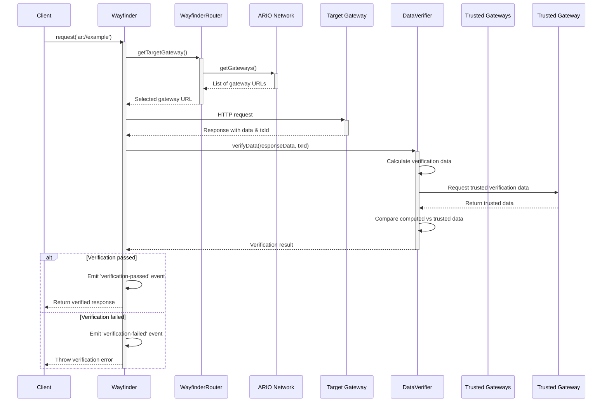

# Wayfinder

Wayfinder is a client-side routing and verification solution for Arweave content. It enables applications to retrieve data through decentralized gateways while ensuring integrity through cryptographic verification.

## Quick Start

```javascript
import { Wayfinder } from '@ar-io/sdk';

// create a new Wayfinder instance with default settings
const wayfinder = new Wayfinder();

// use Wayfinder to fetch and verify data using ar:// protocol
const response = await wayfinder.request('ar://example-name');
```

## ar:// Protocol

Wayfinder supports several ar:// URL formats:

```bash
ar://TRANSACTION_ID              // Direct transaction ID
ar://NAME                        // ArNS name
ar:///info                       // Gateway endpoint (/info)
ar://NAME/path/to/resource       // ArNS with path
```

## Routing Strategies

Wayfinder supports multiple routing strategies to select target gateways for your requests.

| Router                  | Description                                             | Use Case                                |
| ----------------------- | ------------------------------------------------------- | --------------------------------------- |
| `RandomGatewayRouter`   | Selects a random gateway from a list                    | Good for load balancing and resilience  |
| `StaticGatewayRouter`   | Always uses a single gateway                            | When you need to use a specific gateway |
| `PriorityGatewayRouter` | Selects gateways by network stake metrics               | When prioritizing well-staked gateways  |
| `SimpleCacheRouter`     | Caches a router's selected gateway for a specified time | Reduces gateway selection overhead      |

### RandomGatewayRouter

Selects a random gateway.

```javascript
const router = new RandomGatewayRouter({
  gatewaysProvider: new NetworkGatewaysProvider({ ario: ARIO.mainnet() }),
  blocklist: ['gateway-to-avoid.com'], // Optional blocklist
});
```

### StaticGatewayRouter

Always uses a single gateway.

```javascript
const router = new StaticGatewayRouter({
  gateway: 'https://arweave.net',
});
```

### PriorityGatewayRouter

Selects gateways by network stake metrics.

```javascript
const router = new PriorityGatewayRouter({
  ario: ARIO.mainnet(),
  sortBy: 'operatorStake', // Sort by operator stake
  sortOrder: 'desc', // Highest stake first
  limit: 10, // Consider top 10 gateways
});
```

### SimpleCacheRouter

Caches a target gateway for a specified time.

```javascript
const router = new SimpleCacheRouter({
  router: new RandomGatewayRouter({
    gatewaysProvider: new NetworkGatewaysProvider({ ario: ARIO.mainnet() }),
  }),
  ttlSeconds: 300, // Cache gateway selection for 5 minutes
});
```

## Verification Strategies

Wayfinder includes verification mechanisms to ensure the integrity of retrieved data.

| Verifier           | Complexity | Performance | Security | Description                                                                                                  |
| ------------------ | ---------- | ----------- | -------- | ------------------------------------------------------------------------------------------------------------ |
| `HashVerifier`     | Low        | High        | Low      | Verifies data integrity using SHA-256 hash comparison                                                        |
| `DataRootVerifier` | Medium     | Medium      | Low      | Verifies data using Arweave by computing the data root for the transaction (most useful for L1 transactions) |

### HashVerifier

```javascript
import {
  HashVerifier,
  StaticGatewaysProvider,
  TrustedGatewaysHashProvider,
} from '@ar-io/sdk';

const wayfinder = new Wayfinder({
  httpClient: axios,
  router: new RandomGatewayRouter({
    gatewaysProvider: new NetworkGatewaysProvider({ ario: ARIO.mainnet() }),
  }),
  verifier: new HashVerifier({
    trustedHashProvider: new TrustedGatewaysHashProvider({
      gatewaysProvider: new StaticGatewaysProvider({
        gateways: ['https://permagate.io'],
      }),
    }),
  }),
});
```

### DataRootVerifier

```javascript
import {
  DataRootVerifier,
  StaticGatewaysProvider,
  TrustedGatewaysDataRootProvider,
} from '@ar-io/sdk';

const wayfinder = new Wayfinder({
  httpClient: axios,
  router: new RandomGatewayRouter({
    gatewaysProvider: new NetworkGatewaysProvider({ ario: ARIO.mainnet() }),
  }),
  verifier: new DataRootVerifier({
    trustedDataRootProvider: new TrustedGatewaysDataRootProvider({
      gatewaysProvider: new StaticGatewaysProvider({
        gateways: ['https://arweave.net'],
      }),
    }),
  }),
});
```

## Monitoring and Events

Wayfinder emits events during the routing and verification process, allowing you to monitor its operation.

```javascript
const wayfinder = new Wayfinder({
  events: {
    onVerificationPassed: (event) => {
      console.log(`Verification passed for transaction: ${event.txId}`);
    },
    onVerificationFailed: (event) => {
      console.error(
        `Verification failed for transaction: ${event.txId}`,
        event.error,
      );
    },
    onVerificationProgress: (event) => {
      const percentage = (event.processedBytes / event.totalBytes) * 100;
      console.log(
        `Verification progress for ${event.txId}: ${percentage.toFixed(2)}%`,
      );
    },
  },
});

// Or use the event emitter directly
wayfinder.emitter.on('routing-succeeded', (event) => {
  console.log(`Request routed to: ${event.targetGateway}`);
});

wayfinder.emitter.on('routing-failed', (event) => {
  console.error(`Routing failed: ${event.error.message}`);
});
```

## Advanced Usage

### Custom URL Resolution

```javascript
// Get the resolved URL without making a request
const redirectUrl = await wayfinder.resolveUrl({
  originalUrl: 'ar://example-name',
});
console.log(`This request would be routed to: ${redirectUrl}`);
```

### Using With Different HTTP Clients

By default, Wayfinder uses native `fetch` for HTTP requests. You can also use other HTTP clients like `axios` or `node-fetch`. When making a request, Wayfinder will use the HTTP client you provide and any additional configuration you provide.

```javascript
import axios from 'axios';

// create a custom axios instance
const axios = axios.create({
  timeout: 10000,
});
const wayfinderAxios = new Wayfinder({ httpClient: axios });

// add custom headers on the request
const response = await wayfinderAxios.request('ar://example', {
  headers: {
    'X-Custom-Header': 'test',
  },
});
```

## Request Flow

The following sequence diagram illustrates how Wayfinder processes requests:


