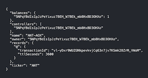

# Typescript React Example - Vite

This example shows how to use the `@ar.io/sdk` within a Typescript/React project using [Vite].

## Getting Started

1. Install the dependencies:

```bash
yarn
```

2. Start the development server:

```bash
yarn start
```

3. Open your browser and navigate to `http://localhost:3000`. You should see:



## Polyfills

The `@ar.io/sdk` uses some modern browser features that may not be available in all browsers. To ensure compatibility, you may need to include polyfills when your `tsconfig.json` uses `moduleResolution: "node"`.

The [tsconfig.json](./tsconfig.json) includes the following compiler options:

```json
{
  "compilerOptions": {
    "moduleResolution": "node",
    "lib": ["es2015", "dom"]
  }
}
```

The [vite.config.js](./vite.config.js) file includes the following polyfills required for the `@ar.io/sdk`:

```javascript
import react from '@vitejs/plugin-react';
import { defineConfig } from 'vite';
import { nodePolyfills } from 'vite-plugin-node-polyfills';

export default defineConfig({
  build: {},
  base: '/',
  plugins: [react(), nodePolyfills()],
});
```

If you're project is using `moduleResolution: "nodenext"`, you can remove the polyfills from the webpack configuration and use named export for web - `@ar.io/sdk/web` - which includes the necessary polyfills.
