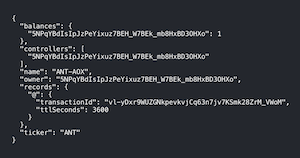

# Typescript React Example

This example shows how to use the `@ar.io/sdk` within a Typescript/React project.

## Getting Started

1. Install the dependencies:

```bash
yarn
```

2. Start the development server:

```bash
yarn start
```

3. Open your browser and navigate to `http://localhost:3000`. You should see:



## Polyfills

The `@ar.io/sdk` uses some modern browser features that may not be available in all browsers. To ensure compatibility, you may need to include some polyfills. This example uses the [node-polyfill-webpack-plugin] plugin to include the necessary polyfills.

The [tsconfig.json](./tsconfig.json) includes the following compiler options:

```json
{
  "compilerOptions": {
    "moduleResolution": "Bundler", // or nodenext are reccomended to use named exports (e.g. @ar.io/sdk/web)
    "lib": ["es2015", "dom"]
  }
}
```

The [webpack.config.js](./webpack.config.js) file includes the following polyfills required for the `@ar.io/sdk`:

```javascript
const NodePolyfillPlugin = require('node-polyfill-webpack-plugin');

module.exports = {
  // other webpack configuration
  resolve: {
    fallback: {
      fs: require.resolve('browserify-fs'), // not provided by NodePolyfills, so provide it here
    },
  },
  polyfills: [new NodePolyfills()], // supports core node packages like `crypto`, `process`, etc.
};
```

If you are using a bundler other than Webpack, you may need to include the necessary polyfills in a similar way.

[node-polyfill-webpack-plugin]: https://www.npmjs.com/package/node-polyfill-webpack-plugin

`;
